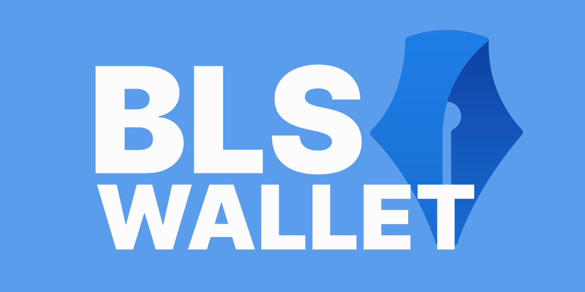

An Ethereum Layer 2 smart contract wallet that uses [BLS signatures](https://en.wikipedia.org/wiki/BLS_digital_signature) and aggregated transactions to reduce gas costs.

You can watch a full end-to-end demo of the project [here](https://www.youtube.com/watch?v=MOQ3sCLP56g)

## Getting Started

- [See an overview of BLS Wallet & how the components work together](./docs/system_overview.md)
- [Use BLS Wallet in a browser/NodeJS/Deno app](./docs/use_bls_wallet_clients.md)
- Setup the BLS Wallet components for:
  - [Local develeopment](./docs/local_development.md)
  - [Remote development](./docs/remote_development.md)

## Components

[contracts](./contracts/)

Solidity smart contracts for wallets, BLS signature verification, and deployment/testing tools.

[aggregator](./aggregator/)

Service which accepts BLS signed transactions and bundles them into one for submission.

[aggregator-proxy](./aggregator-proxy/)

npm package for proxying to another aggregator instance.

[bls-wallet-clients](./contracts/clients/)

npm package which provides easy to use constructs to interact with the contracts and aggregator.

[extension](./extension/) 

Prototype browser extension used to manage BLS Wallets and sign transactions.
