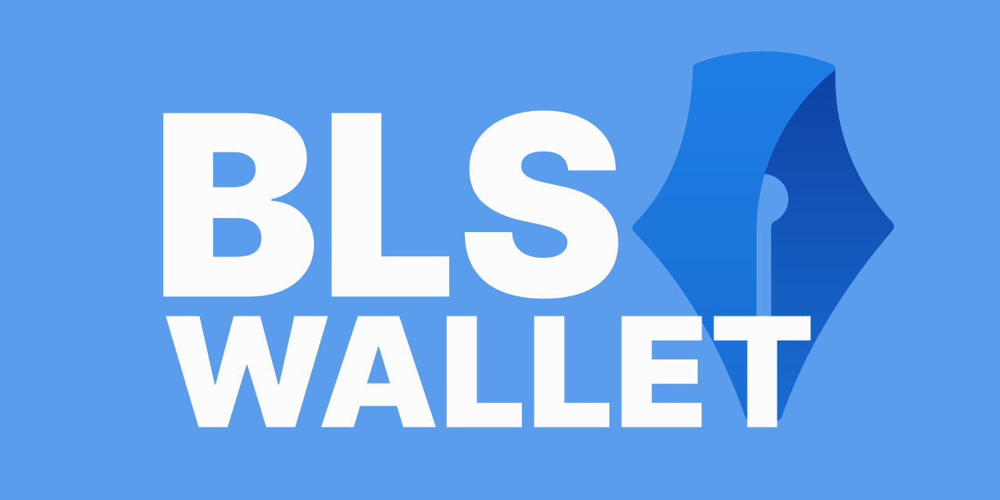

An Ethereum Layer 2 smart contract wallet that uses [BLS signatures](https://en.wikipedia.org/wiki/BLS_digital_signature) and aggregated transactions to reduce gas costs.

You can watch a full end-to-end demo of the project [here](https://www.youtube.com/watch?v=MOQ3sCLP56g)

## Getting Started

- [See an overview of BLS Wallet & how the components work together](./docs/system_overview.md)
- [Use BLS Wallet in a browser/NodeJS/Deno app](./docs/use_bls_wallet_clients.md)
- [Use BLS Wallet in your L2 dApp for cheaper, multi action transactions](./docs/use_bls_wallet_dapp.md)
- Setup the BLS Wallet components for:
  - [Local develeopment](./docs/local_development.md)
  - [Remote development](./docs/remote_development.md)

## Components

[contracts](./contracts/)

Solidity smart contracts for wallets, BLS signature verification, and deployment/testing tools.

[aggregator](./aggregator/)

Service which accepts BLS signed transactions and bundles them into one for submission.

[aggregator-proxy](./aggregator-proxy/)

npm package for proxying to another aggregator instance.

[bls-wallet-clients](./contracts/clients/)

npm package which provides easy to use constructs to interact with the contracts and aggregator.

[extension](./extension/)

Prototype browser extension used to manage BLS Wallets and sign transactions.

## Contract Addresses: Aribitrum Goerli 
    
    "create2Deployer": "0x036d996D6855B83cd80142f2933d8C2617dA5617"
    "precompileCostEstimator": "0x22E4a5251C1F02de8369Dd6f192033F6CB7531A4"
    "blsLibrary": "0xF8a11BA6eceC43e23c9896b857128a4269290e39"
    "verificationGateway": "0xAf96d6e0817Ff8658f0E2a39b641920fA7fF0957"
    "blsExpander": "0x376E7c0dA79423F772C2837744F81a7A0ff4bA47"
    "utilities": "0x957e58EfEB6cE40F95f3dBFAaCD9465Df5C29E23"
    "testToken": "0xa513E6E4b8f2a923D98304ec87F64353C4D5C853"

## Ways to Contribute

- [Work on an open issue](https://github.com/web3well/bls-wallet/issues?q=is%3Aopen+is%3Aissue+label%3A%22good+first+issue%22)
- [Use BLS Wallet](./docs/use_bls_wallet_clients.md) in your project and [share it with us](https://github.com/web3well/bls-wallet/discussions)
- [Report a bug or request a feature](https://github.com/web3well/bls-wallet/issues/new)
- [Ask a question or answer an existing one](https://github.com/web3well/bls-wallet/discussions)
- [Try or add to our documentation](https://github.com/web3well/bls-wallet/tree/main/docs)

See our [contribution instructions & guidelines](./CONTRIBUTING.md) for more details.
