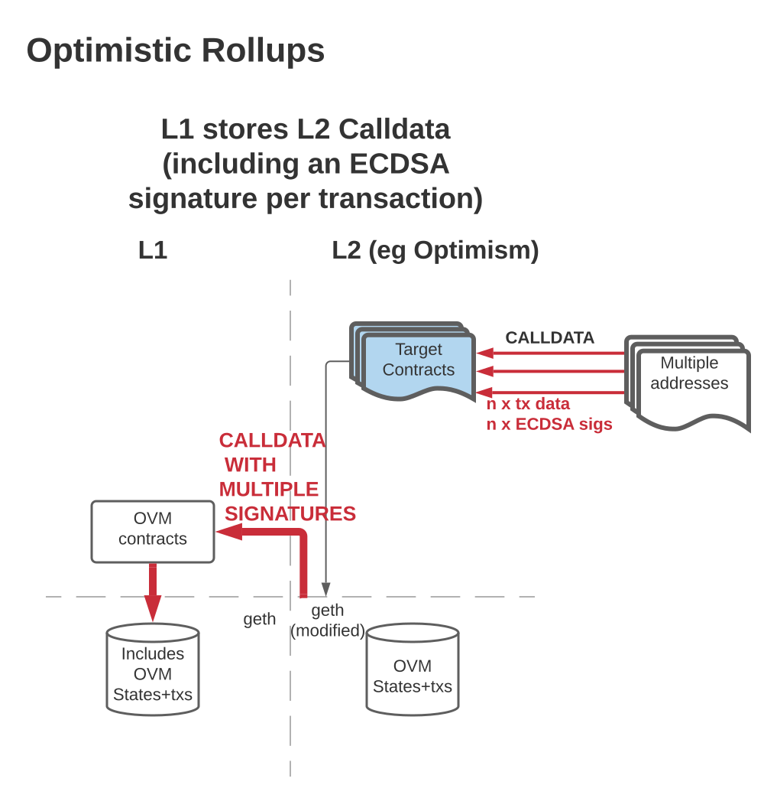
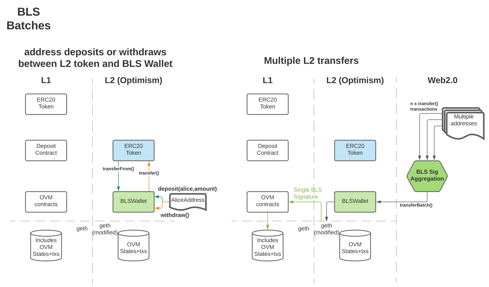

# BLS Aggregate Signature Wallet

## Optimistic Rollups
"Currently every tx on OR puts an ECDSA signature on chain." - BWH

Simplification of Optimism's L2 solution:

## Transactions via BLS signature aggregator
"We want to replace this with a BLS signature." - BWH

Proposed solution to make use of [BLS](https://github.com/thehubbleproject/hubble-contracts/blob/master/contracts/libs/BLS.sol) lib:

