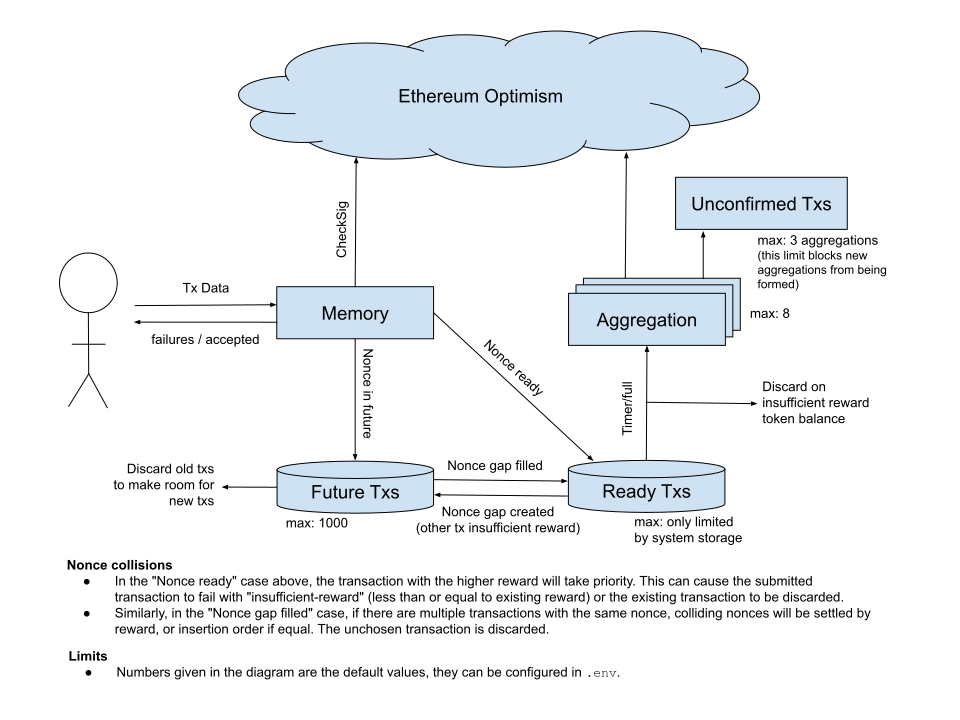

# BLS Aggregator

Aggregation service for bls-signed transaction data.

Accepts posts of signed transactions and, upon instruction, can aggregate
signatures and submit a transaction batch to the configured Verification
Gateway.

## Installation

Install [Deno](deno.land).

### Configuration

```sh
cp .env.example .env
```

Edit values as needed, e.g. private key and contract addresses.

You can also configure multiple environments by appending `.<name>`, for example
you might have:

```
.env.local
.env.optimistic-kovan
```

If you don't have a `.env`, you will need to append `--env <name>` to all
commands.

### PostgreSQL

Install, e.g.:

```sh
sudo apt install postgresql postgresql-contrib
```

Create a user called `bls`:

```
$ sudo -u postgres createuser --interactive
Enter name of role to add: bls
Shall the new role be a superuser? (y/n) n
Shall the new role be allowed to create databases? (y/n) y
Shall the new role be allowed to create more new roles? (y/n) n
```

Set the user's password:

```
$ sudo -u postgres psql                                                
psql (12.6 (Ubuntu 12.6-0ubuntu0.20.04.1))
Type "help" for help.

postgres=# ALTER USER bls WITH PASSWORD 'blstest';
```

Create a table called `bls_aggregator`:

```sh
sudo -u postgres createdb bls_aggregator
```

On Ubuntu (and probably elsewhere), postgres is configured to offer SSL
connections but with an invalid certificate. However, the deno driver for
postgres doesn't support this.

There are two options here:

1. Set up SSL with a valid certificate
   ([guide](https://www.postgresql.org/docs/current/ssl-tcp.html)).
2. Turn off SSL in postgres (only for development or if you can ensure the
   connection isn't vulnerable to attack).
   1. View the config location with
      `sudo -u postgres psql -c 'SHOW config_file'`.
   2. Turn off ssl in that config.
      ```diff
      -ssl = on
      +ssl = off
      ```
   3. Restart postgres `sudo systemctl restart postgresql`.

## Running

Can be run locally or hosted.

```sh
./programs/aggregator.ts
# Or if you have a named environment (see configuration section):
# ./programs/aggregator.ts --env <name>
```

## Testing

- launch optimism
- deploy contract script
- run tests

NB each test must use unique address(es). (+ init code)

## Development

VSCode + Deno extension

## System Diagram



## Hosting Guide

1. Configure your server to allow TCP on ports 80 and 443
2. Follow the [Installation](#Installation) instructions
3. Run `./programs/build.ts` (supplying `--env` if using a named env)
4. Run `docker build . -t aggregator`
