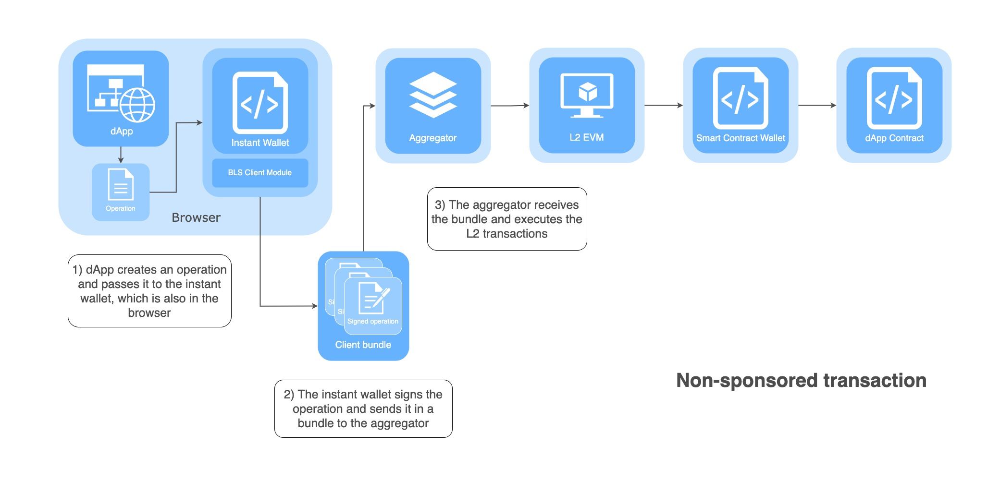
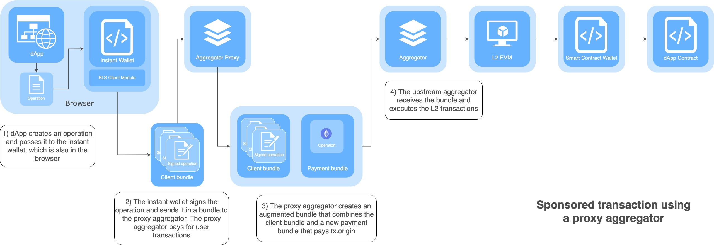

# Aggregator Proxy

[](https://www.npmjs.com/package/bls-wallet-aggregator-proxy)

This package makes it easy to provide an aggregator by proxying another. The primary use-case is to expose a free aggregator based on one that requires payment by augmenting the bundles with transactions that pay `tx.origin`.

## Setup

```sh
npm install bls-wallet-aggregator-proxy
yarn install bls-wallet-aggregator-proxy
```

## Usage

```ts
import {
  runAggregatorProxy,

  // AggregatorProxyCallback,
  // ^ Alternatively, for manual control, import AggregatorProxyCallback to
  // just generate the req,res callback for use with http.createServer
} from 'bls-wallet-aggregator-proxy';

runAggregatorProxy(
  'https://arbitrum-goerli.blswallet.org',
  async bundle => {
    console.log('proxying bundle', JSON.stringify(bundle, null, 2));

    // Return a different/augmented bundle to send to the upstream aggregator
    return bundle;
  },
  8080,
  '0.0.0.0',
  () => {
    console.log('Proxying aggregator on port 8080');
  },
);
```

## Instant wallet without dapp-sponsored transaction


## Instant wallet with dapp-sponsored transaction


## Example dApp using a proxy aggregator

- https://github.com/JohnGuilding/single-pool-dex