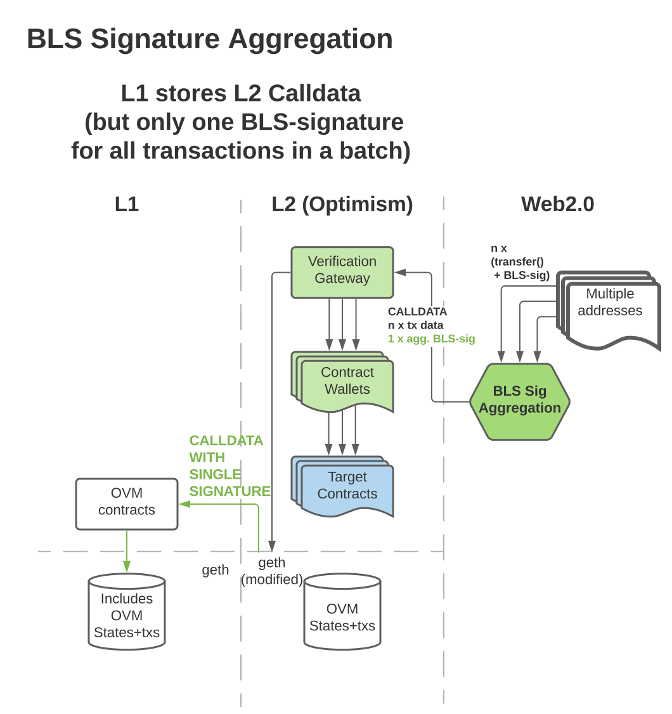

# BLS Contract Wallet

Lower-cost layer 2 transactions via a smart contract wallet.

**Note:** _These contracts are in the process of being formally audited and are currently NOT recommended for production use._

## Background

Smart contract wallets give users additional safety mechanisms independent of any wallet UI they may use, but are expensive to deploy (and use on) on Ethereum's layer 1.

Layer 2 solutions like Optimism and Arbitrum greatly lower this cost-barrier, and allow more users to benefit from smart contract wallets. This is primarily due to these being general purpose computation solutions.

DApps bridged to layer 2 will be more usable than those only on layer 1 thanks to faster transactions at lower-cost, but there are further gas savings to be had by dapps and users.

## Savings

Parameters of external layer 2 transactions are stored on layer 1 when "co-ordinators" record state changes. Reducing the size/number of parameters sent to layer 2 calls greatly reduces the layer 1 cost co-ordinators would need to recoup from users.

So as well as the benefits of smart contract wallets and layer 2 usage, gas savings from reduced call data is achieved in 3 ways:

1. single aggregated signature (BLS)
2. de-duplicate of parameters across aggregated txs
3. compressed parameters

Note: each of these savings is proportional to the number of transactions submitted in a batch. So when using all three methods, additional savings are roughly O(3n).

# Usage

1. Create bls keypair from signer/wallet
2. Sign creation message and either: send it via an agreggator, or directly pass in a call to the Verification Gateway contract

- receive contract wallet address

3. Create contract wallet with existing ECDSA keypair

## See it in action

See `extension`

# Components

## Layer 2 contract: Verification Gateway

Creates contract wallets deterministically (create2) with the hash of respective bls public keys. It verifies a set of actions (`Operation`) that have been signed with a known bls keypair, then calls the corresponding wallet passing parameters for it to action. Generally this will be an aggregated signature for many different wallets' Operations (`Bundle`).

## Layer 2 contract: BLS Wallet

A smart contract wallet for users to interact with layer 2 dapps. Created via the aforementioned verification gateway.
Wallets use the proxy upgrade method, and can call upon their proxy admin to change their implementation. Wallets can also choose to set a different contract as their trusted verification gateway.

### Upgradability

The verification gateway (VG1) is the `owner` of a single proxy admin (PA1), and is responsible for all VG1 wallets. A wallet can call `walletAdminCall` on VG1 to then call `upgrade` to change it's implementation.
If in the future a new verification gateway is created (say VG2/PA2), a wallet can choose to set it's trusted gateway to this instead. That means VG1 will no longer be permitted to make arbitrary calls to the wallet, only VG2. Note: PA1 will remain as the proxy admin of the wallet. The wallet can change this to PA2 via an admin call on VG1 to `changeProxyAdmin`.

## Client tool: BLS Wallet/Signer

Wallets (eg Metamask, Argent, ...) to implement BLS keypair generation and signing.

## Relayer node: Aggregators

Network to take bls-signed messages, aggregate signatures, then action them via a call to the Verification Gateway.

## Layer 2 node: Coordinators

Network that takes layer 2 transactions and creates blocks. general purpose computation solutions (Optimism, Arbitrum, zkSync)

## Message format

For a smart contract wallet to perform an action, the signed message must contain:

- the hash of the bls public key that signed the message (the full public key is mapped in the Verification Gateway)
- nonce of the smart contract wallet
- address of the smart contract for the wallet to call
- methodId of the function to call
- ABIencoded parameters for the function
- amount to transfer

## Layer 2 contract: Further optimisations

While the Verification Gateway requires only one aggregated signature (rather than each signature of a set of messages and data), the other optimisations can be gained incrementally via preceding smart contracts.

| Compressed data | No duplicates | Aggregated signature | Contract to call     |
| --------------- | ------------- | -------------------- | -------------------- |
| ✓               | ✓             | ✓                    | Decompressor         |
|                 | ✓             | ✓                    | Expander             |
|                 |               | ✓                    | Verification Gateway |

# Diagrams

## Optimistic Rollups

"Currently every tx on OR puts an ECDSA signature on chain." - BWH

Simplification of Optimism's L2 solution:

## Transactions via BLS signature aggregator

"We want to replace this with a BLS signature." - BWH

Proposed solution to make use of [BLS](https://github.com/thehubbleproject/hubble-contracts/blob/master/contracts/libs/BLS.sol) lib:

# Dev/test

- Run the aggregation server (see `../aggregator`).
- build and test contracts - `yarn hardhat test`

-Note: Depending on the network being used, the address of the deployed PrecompileCostEstimator will need to be set [here](https://github.com/jzaki/bls-wallet/blob/main/contracts/contracts/lib/hubble-contracts/contracts/libs/BLS.sol#L42).

For each network, the deployer contract can be deployed with the following script (only needed once)
`DEPLOY_DEPLOYER=true yarn hardhat run scripts/deploy-deployer.ts --network <network-name>`

## Integration tests

To run integration tests:

1. cd into `./contracts` and run `yarn start-hardhat`
2. cd into `./aggregator` and run `./programs/aggregator.ts`
3. from `./contracts`, run `yarn test-integration`.

## Optimism's L2 (paused)

- clone https://github.com/ethereum-optimism/optimism
- follow instructions (using latest version of docker)
- in `opt/`, run script - `docker-compose up`
  - L1 - http://localhost:9545 (chainId 31337)
  - L2 - http://localhost:8545 (chainId 420)

## Deploy scripts

Specify network - `yarn hardhat run scripts/<#_script.ts> --network arbitrum-goerli`

# License

MIT
